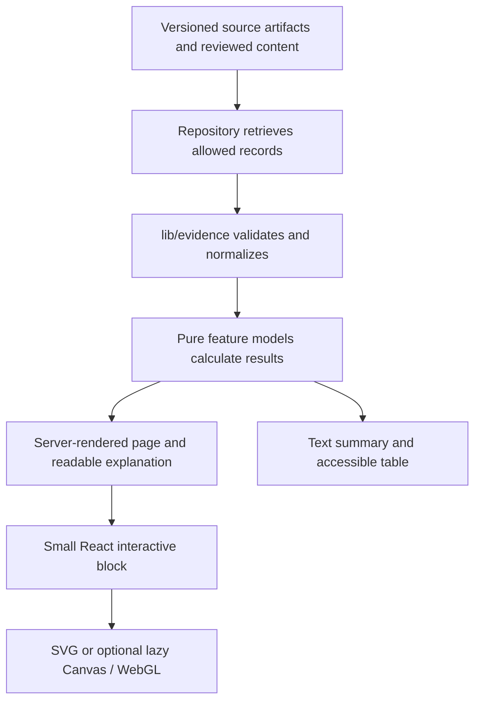

# ATOM learning experience design

Date: 2026-09-21. Status: proposed design for the requested planning exercise; no product implementation or evidence release is approved by this document.

## 1. Intended outcome

Make ATOM a memorable, approachable place to understand atomic energy by trying things. A visitor should arrive with a question, manipulate a clear visual, understand what changed, inspect the evidence, and know what to explore next. Nuclear energy supplies the central theme; electricity systems and India's development supply the context.

The user's priorities are a modern, simple website; excellent graphics; playful experiments; meaningful levels and learning paths; myths examined clearly; purposeful animation, transitions and optional sound; and a small maintainable architecture.

Interpret the ambition to promote nuclear as making its potential understandable and worth investigating. The recommended editorial approach retains the repository's evidence-first policy: present benefits confidently when supported, explain limitations, and allow evidence to change the conclusion. Do not turn a preferred policy outcome into a simulator's scoring rule.

Three wording decisions are explicit:

- Describe nuclear as low-carbon, distinguishing operation from the full fuel, construction and decommissioning lifecycle. An operational claim cannot stand in for a lifecycle claim.
- Investigate when nuclear is affordable. Separate existing-plant operation from new construction, financing, project delays, fuel, decommissioning and system costs. The [IEA's nuclear assessment](https://www.iea.org/reports/the-path-to-a-new-era-for-nuclear-energy/executive-summary) identifies both low-emissions electricity benefits and substantial delivery/financing challenges.
- Frame India around higher living standards, productive electricity use and dependable low-carbon supply. India is already lower-middle-income in [World Bank country metadata](https://wits.worldbank.org/Country-Metadata.aspx). A power-system model cannot establish a causal GDP or income-classification outcome.

These are the proposed resolution of the promotional-language conflict with `EVIDENCE-AND-EDITORIAL-POLICY.md`. An explicitly advocacy-led mission would require a recorded product-policy revision before changing public mission copy. No such revision is silently made here.

## 2. Direction and alternatives

| Direction                    | Strength                                                               | Trade-off                                                               | Decision                                                  |
| ---------------------------- | ---------------------------------------------------------------------- | ----------------------------------------------------------------------- | --------------------------------------------------------- |
| Interactive science museum   | Strong learning loop; room for serious evidence and memorable exhibits | Needs excellent lesson composition and a few carefully finished visuals | Recommended                                               |
| Cinematic, immersive 3D site | Immediate spectacle; useful for spatial reactor understanding          | Expensive mobile experience, weaker reading, more graphics code         | Keep 3D as an optional exhibit view                       |
| Text-first reference library | Fast and straightforward to maintain                                   | Does not fulfil the playful, lasting-impression ambition                | Use its readable structure for evidence and expert detail |

The visual target is **“From a tiny nucleus to everyday life.”** A restrained, tactile science exhibit sits inside a clear editorial website. It should feel precise and inviting, with room to breathe.

## 3. Visual system

Retain Geist, the existing semantic tokens, CSS Modules, shared shell and component vocabulary. Repair token contrast and remove hard-coded theme conflicts as each surface is touched. Avoid a parallel visual framework.

- Warm paper reading surfaces and deep ink exhibit surfaces, with intentional light/dark equivalents.
- Violet identifies nuclear consistently; cyan traces selected flow; amber distinguishes heat or an explanatory highlight. Existing energy-source identities remain stable across every page.
- Large, legible headings; short labels; comfortable 16–20px body text; approximately 70 characters per prose line. Do not put pale gradient text on a pale background.
- Crisp vector diagrams, sectional cutaways, direct labels and measured whitespace. Use restrained shadows to communicate layers and selected controls.
- Orbit lines identify the brand; a nucleus-to-grid motif ties the journeys together. Orbit artwork is a stylized mark, not a scientifically literal depiction of electron paths.
- Use icons to clarify labels, not a different emoji and glowing badge for every card. Sources and serious historical narratives have calm typography.
- One dominant visual and one primary action per section. Charts and reading pages do not need floating particles.

### Homepage storyboard

**Desktop, 1440 × 900:** compact header; roughly half-width promise and Start exploring action on the left; a large labeled nucleus → heat → steam → turbine → electricity exhibit on the right. The first useful action is visible without scrolling. Below it: three questions, a featured released comparison, a learning-path preview, an India invitation when released, and the evidence promise.

**Mobile, 390 × 844:** brand, labeled menu and compact preferences; short headline; Start exploring; a readable diagram; a tap-to-step control. Questions and paths follow vertically. No horizontal navigation strip or miniature desktop dashboard.

Proposed hero copy: **“Small atoms. Big questions.”** Supporting line: “Explore how nuclear energy works, what it changes, and where the trade-offs lie.” Primary action opens the first released guided journey. Secondary action opens Comparison Lab. If lessons are not released, the first action opens the guided comparison.

Hero steps teach conversion, not quantitative national supply. No demand dial that implies a decorative city is an adequacy model. The quantitative Power India scenario lives in its own reviewed exhibit.

### Lesson storyboard

Question and objective → prediction → one experiment → observed result → explanation at the selected level → check understanding → evidence → next recommended step.

Desktop keeps a single reading column with the exhibit allowed to widen. Mobile keeps the same sequence. An expandable “Why?” or “Show the maths” adds detail without moving the learner to another page. A persistent but small “Your path” link supplies orientation.

### Required visual artifacts before implementation

Produce desktop/mobile home, fission lesson, comparison, and India storyboard frames using real-length content. Include light/dark pairs for home and lesson, one evidence sheet, reduced-motion steps, and narrow-screen controls. Record the selected frames under `docs/design/2026-09-21-learning-experience/`; the current audit screenshots are baseline evidence, not these future targets.

## 4. Navigation and routes

Primary navigation: **Learn · Explore · Compare · Evidence**. Search and preferences are utilities. About, methodology, corrections and accessibility live in the footer. India is prominent on home and Explore once released, with a canonical `/india` route; it does not require a separate app.

| Existing route                          | Role in the revised experience                                              |
| --------------------------------------- | --------------------------------------------------------------------------- |
| `/`                                     | Orientation, signature visual and next action                               |
| `/learn`                                | Select a path; resume; browse published lessons                             |
| `/learn/[lesson]`                       | The single canonical lesson URL hierarchy                                   |
| `/topics`, `/topics/[topic]`            | Reference browsing and subject coverage                                     |
| `/explore`                              | Published experiments grouped by a learner's question                       |
| `/simulations`                          | Preserve as a focused experiment index; link to the same interactive blocks |
| `/how-it-works`                         | Guided overview using those same blocks; retain URL                         |
| `/compare`                              | First public flagship; compare and inspect evidence                         |
| `/myths`                                | Claim investigations with contextual verdicts and sources                   |
| `/debates`, `/debates/[topic]`          | Longer contested questions and trade-offs                                   |
| `/reactors`, `/reactors/[concept]`      | Design directory and illustrated component explorer                         |
| `/globe`                                | Fleet directory with optional map/globe                                     |
| `/radiation`, `/incidents`              | Quantity-safe exploration and serious historical explanation                |
| `/sources`, `/evidence`, `/methodology` | Bibliography, inspectable records and methods, with distinct purposes       |
| `/grid`                                 | Clearly bounded energy-system experiment                                    |
| `/ask`                                  | Curated evidence answers first; generated answers only after evaluation     |

Restore planned `/evidence/sources/[sourceId]`, `/evidence/studies/[studyId]`, `/evidence/datasets/[datasetVersionId]` as real metadata routes. Add `/accessibility` and `/corrections` with truthful information. Do not add `/learn/paths/.../lessons/...` aliases. Path context can use a validated query parameter while lessons retain their canonical URL.

Published navigation, search, source metadata and direct route access must use the same release decisions. A content title or a declared `published` flag is insufficient without the required review record.

## 5. Five levels and learning paths

**Depth and path are separate.** Depth changes how a concept is explained; a path decides which concepts come next. A visitor can change either without losing answers or an experiment's configuration. No account or placement test is required.

Preserve existing internal values and persisted preferences. Present the repository's established public labels; support old shared values through explicit aliases if needed.

| Level        | Internal value | Presentation and task                                                             | Fission example                                                            |
| ------------ | -------------- | --------------------------------------------------------------------------------- | -------------------------------------------------------------------------- |
| L1 Kid       | `beginner`     | Short narration, labeled picture, one button, concrete prediction                 | Send a neutron; observe splitting and energy release                       |
| L2 Simple    | `explorer`     | Plain language, a small number of controls, explain cause and effect              | Compare a continuing chain with one that fades                             |
| L3 Curious   | `curious`      | Default; numerical context, units, trade-offs and source summary                  | Follow neutron production, absorption and escape                           |
| L4 Technical | `deep-dive`    | Equations, model assumptions, ranges and parameter sensitivity                    | Inspect multiplication and delayed-neutron concepts with limits stated     |
| L5 Expert    | `geeky`        | Source-level records, derivations, competing models, error/uncertainty discussion | Inspect the precise model and data basis, including what it cannot predict |

Expert depth is not merely jargon or an extra paragraph. Simpler levels retain a way to inspect the same numbers and sources. Hidden advanced controls preserve their state and show an active-assumptions summary when they affect output.

### Curriculum to build incrementally

All new lessons start as drafts. Estimated durations are authoring targets and must be checked with learners before being shown as measured facts.

| Path                     | Intended starting level | Ordered curriculum                                                                                                                                                    | Signature outcome                                                   |
| ------------------------ | ----------------------- | --------------------------------------------------------------------------------------------------------------------------------------------------------------------- | ------------------------------------------------------------------- |
| Start with atoms         | L1–L2                   | Energy and power → atom → isotope → fission → heat-to-electricity → safety barriers → waste basics                                                                    | Explain how a reactor makes electricity                             |
| Nuclear in everyday life | L2–L3                   | Fundamentals recap → radiation quantities → common exposures → nuclear medicine/industry → safety context                                                             | Distinguish exposure types and useful applications                  |
| Climate and electricity  | L2–L4                   | Energy versus power → lifecycle boundaries → comparison → annual grid balance → variability/firm supply → system limits                                               | Compare portfolios without confusing annual energy with reliability |
| Investigate the claims   | L2–L5                   | Read a claim → inspect evidence → accident history → waste → costs → uncertainty                                                                                      | Explain a conclusion and what would change it                       |
| Engineering the reactor  | L3–L5                   | Neutron economy → reactor components → heat loops → control/feedback → design differences → fuel cycle                                                                | Read a reactor schematic and identify model limitations             |
| Power India's future     | L2–L5                   | India's dated baseline → capacity versus generation → industrial and household demand → PHWR/fleet → construction/finance → alternative portfolios → thorium maturity | Explain opportunities and constraints in a chosen scenario          |
| Research desk            | L4–L5                   | Source provenance → representative estimates → uncertainty → cost assumptions → dataset comparison/export                                                             | Reproduce a supported calculation                                   |

Start with the existing seven-lesson fundamentals sequence. Add isotope material inside the atom lesson before deciding it warrants a new prerequisite. Every path has a useful released stopping point; do not display a largely empty curriculum as complete.

Retain local progress, adding schema validation and version handling. Mark completion after the checkpoint/declared task, not after opening a page. Offer retry, resume and reset. Updated content should indicate when a previously completed lesson merits review. Do not punish missed days or use competitive streaks.

## 6. Experiment portfolio

Every experiment needs a learning objective, prediction, control, observable result, explanation, reset, sources, model/version and limitations. Playback additionally needs pause, replay and steps. Keyboard and touch must reach every meaningful action.

| Exhibit                  | Learner action                                                                | Graphic and feedback                                                     | Domain/evidence requirement                                                                                  | Priority               |
| ------------------------ | ----------------------------------------------------------------------------- | ------------------------------------------------------------------------ | ------------------------------------------------------------------------------------------------------------ | ---------------------- |
| Fission                  | Predict, send one neutron, step through capture/splitting, compare absorption | Labeled 2D particles; event log; count and energy only from model        | Move stochastic rules out of React; seeded replay; distinguish illustrative geometry from calculated physics | First polished lesson  |
| Atom and isotope builder | Change proton/neutron counts                                                  | Nucleus and labeled electron-cloud abstraction; identity table           | Element identity from proton count; stability only from reviewed nuclide records; unknown means unknown      | Fundamentals           |
| Heat to grid             | Follow energy through core, exchanger, turbine and generator                  | Shared animated flow paths and static step list                          | Reactor-specific loop mapping; no universal efficiency/temperature invented                                  | Fundamentals           |
| Half-life                | Advance one half-life; repeat a sample; scrub time                            | Dot population beside expected decay curve and remaining-quantity table  | Deterministic expected curve distinct from a stochastic sample; isotopic source and timescale                | First expansion        |
| Reactor feedback         | Move one control and watch a bounded response                                 | Cross-section, power trend, textual state, shutdown cooling explanation  | Reviewed illustrative model; no claim of operator-training or design-prediction accuracy                     | After model audit      |
| Radiation                | Choose comparable exposures; inspect duration and quantity                    | Log scale with dedicated zero state; ordered table                       | Activity, dose, effective/equivalent dose and dose rate stay distinct                                        | Safety path            |
| Claim investigation      | Make a prediction, reveal evidence and context                                | Static verdict panel with evidence drawer; subtle transition             | Supported/misleading/context-dependent/insufficient-evidence outcomes, attributable text                     | After evidence repair  |
| Cost workbench           | Change financing, duration and lifetime assumptions                           | Cost composition and sensitivity plot; accessible table                  | Currency/base year, discounting, boundaries and project context; teach why conclusions change                | Before India scenarios |
| Power a city             | Change supply capacity and annual demand                                      | City silhouettes illustrate demand; energy balance is labeled separately | Annual model only at first; missing impact factors stay missing                                              | After grid repair      |
| Power India              | Choose demand and portfolio assumptions; compare saved cases                  | India baseline, labeled portfolio flow, assumptions/results side by side | Dated reviewed inputs; scenarios, not forecasts; no GDP meter                                                | Later flagship         |
| Reactor/fleet explorer   | Select a part or facility; inspect its role/status                            | 2D cutaway or directory first; optional existing 3D                      | One source of component/fleet truth; per-unit status and dated capacity                                      | Progressive polish     |
| Fuel/waste journey       | Follow material stages and compare timescales                                 | Process diagram and restrained timeline                                  | Distinguish heat, activity, radiotoxicity and disposal criteria                                              | After reviewed content |

Do not build them all simultaneously. Finish one complete pattern, then port the existing simulators one at a time.

### Claim presentation

Keep `/myths` discoverable but make the experience an investigation. Show the precise claim, short finding, why people encounter it, the strongest relevant evidence, important caveats, and a next experiment. Do not force every answer into “false.” Cost, sustainability, safety and waste questions often require context.

Examples to author and review: reactors versus bombs at a public conceptual level; operational versus lifecycle emissions; waste storage versus disposal; everyday radiation versus medical/accident contexts; existing nuclear versus new construction cost; capacity factor versus dependable capacity; thorium potential versus current maturity. Accident pages avoid scores, celebratory effects and comic sound.

## 7. Motion and sound

Use existing motion tokens for 150ms control feedback and 250ms UI transitions. Teaching sequences can last longer when the visitor controls playback. Animate an energy path to explain conversion, move a control rod to show the selected state, or interpolate a chart while preserving its labeled values.

- No scroll hijacking or mandatory cinematic intro. Browser back/forward and focus behaviour remain conventional.
- A reduced-motion user gets explicit steps/static states with equal content. CSS preferences alone do not stop JavaScript timers or WebGL loops; those need the same preference and visibility signals.
- Pause work offscreen and when the tab is hidden. Resume only according to the user's playback choice; do not silently restart a stopped lesson.
- No strobing flashes. Cap simultaneous moving particles. Text announcements happen on meaningful user steps, not every frame.

Sound is **off initially**, enabled by an explicit labeled control and independently adjustable. Use a small procedural Web Audio palette: a soft selection tick, a short connection tone, a restrained completion cue, and optional low-volume energy-flow texture within a running experiment. No autoplay music, Geiger-counter ambience, accident alarms or sound on harm narratives.

Persist preference, but create/resume the audio context only after a browser-permitted gesture. Muting stops current sound immediately. Tab hide, route exit and unmount cancel scheduled sounds and dispose resources. Audio failure never interrupts the experiment. Every audible cue also has visible/textual feedback. Reduced motion and sound are separate choices.

## 8. Simple architecture

Keep one Next.js App Router application with the current React/TypeScript/Zod stack. Reuse CSS Modules and semantic tokens. Preserve the existing Three.js dependency only for optional spatial exhibits. Add no new app, service, game engine, global state library, vector database, CMS or animation/audio framework for this redesign.

The current local evidence repository can serve an immutable reviewed release snapshot. It must not manufacture publication from hand-entered flags. The historical Supabase authoring/review architecture was deleted without an ADR: reconcile its state first. Either restore that reviewed authoring path and use local release snapshots for serving, or explicitly approve and test a file-based review/release replacement. Do not add a second serving authority. No external database writes are part of this planning task.

### Reuse and add only what the first exhibit needs

| Boundary          | Existing material                                                      | Planned change                                                                                                 |
| ----------------- | ---------------------------------------------------------------------- | -------------------------------------------------------------------------------------------------------------- |
| Shell/preferences | `AppShell`, complexity/theme hooks, `OverlayPanel`                     | Compact menu, consistent level semantics, optional sound preference                                            |
| Evidence          | `lib/evidence`, `DataPassport`, `ChallengeNumber`, `SourceDrawer`      | Resolve real source/study/version metadata and use shared presentation                                         |
| Charts            | `ComparisonBar`, `RangePlot`, `DistributionPlot`, `ChartTableFallback` | Render validated results; remove parallel Lab bar/dialog logic                                                 |
| Lesson/content    | `lib/education`, JSON catalogs, `LessonViewer`, checkpoints            | Structured typed blocks, path records, claim links, review metadata; retain canonical routes                   |
| Experiments       | `lib/simulator`, current simulator components                          | Pure step/state functions; composable `SimulationFrame` and `InteractiveFigure` introduced in the first lesson |
| Graphics          | Existing SVG and Three.js diagrams                                     | Extract domain-specific reusable diagrams; do not build a universal scene engine                               |
| Audio             | None found                                                             | One lazy adapter and preference, consumed by the exhibit shell                                                 |
| Search            | `lib/search/index.ts`                                                  | Published-only index with lessons, claims, exhibits and sources                                                |

Start with typed JSON/TypeScript content blocks. Introduce MDX only when actual authoring requirements cannot be met comfortably by those blocks. Never execute untrusted remote content. State stays in components; shareable scenarios use versioned, validated URLs; localStorage contains only preferences and optional progress.

## 9. Release order and success

ADR 0001 remains in force: restore a trustworthy Comparison Lab release before new public lesson releases. Design, draft lesson authoring and a private lesson prototype may proceed earlier. The old completion claims and the new code's `published` flags do not establish that gate.

Success means a learner can choose a starting point, explain one concept after interacting, inspect the supporting source and reach a next step. Measure checkpoint understanding, experiment completion, path continuation and evidence engagement in aggregate. Do not optimize for maximum time on site or for agreement with nuclear advocacy.

Use a small moderated pilot spanning novice adults, students, a technical learner and mobile users; recruit child participants only through an appropriate consent process. A first usability target is four of five participants finding a start and reaching the evidence/next step without help. Treat this as formative feedback, not a statistical effectiveness claim.

The release matrix covers 320px reflow, 390 × 844 mobile, 768 × 1024 tablet and 1440 × 900 desktop; light/dark; keyboard; actual 200% zoom; reduced motion; muted/audio enabled; loading/empty/error/restricted states; JavaScript/GPU/network failure; and the evidence chain. Targets remain LCP <2.5s, CLS ≤0.1 and responsive interactions, measured in a recorded mobile test environment. A screenshot or passing unit suite is not full acceptance.

Implementation order, exact file targets and acceptance oracles are in [the task plan](../plans/2026-09-21-atom-learning-experience.md). Current status belongs only in [DELIVERY-TRACKER.md](../../product/DELIVERY-TRACKER.md).
