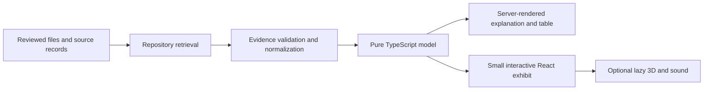

# ATOM: a playable nuclear-energy learning website

Date: 2026-09-27. Deliverable: repository audit and redesign brief for the user's requested step-by-step plan. Implementation is in the [ordered plan](../plans/2026-09-27-playable-atom.md); status belongs only in [DELIVERY-TRACKER](../../product/DELIVERY-TRACKER.md).

## 1. The intended product

Make ATOM a simple, modern, memorable place to understand atomic energy by playing with it. A visitor should be able to split an atom, follow heat into electricity, question a familiar claim, and explore nuclear power's possible contribution to India's future. The experience should make nuclear science approachable and make its low-carbon potential tangible. Sources and trade-offs remain easy to inspect.

Primary audience assumption: curious Indian teenagers, students and general adults, using a phone as often as a laptop. Start in clear English with Indian context, units and examples. Prepare content for later Hindi translation; do not add a translation service or language selector before reviewed translations exist.

The user's explicit direction removes **all reading/explanation levels**. There is one well-written explanation for everyone, followed by optional contextual detail. “Why?”, “Show the maths” and “Sources” open information about the current question; they do not select another audience tier, alter the simulation or hide active assumptions. Learning paths and scientific classifications remain: an INES accident level, a radiation quantity or a chart heading level is not a reading level.

Success: within the first minute, a novice can make something happen and explain the connection; after one short visit they can correct a misconception, inspect a source, and find another worthwhile experiment. These are proposed pilot goals, not measured results.

## 2. Positioning and explicit decisions

| Decision       | Direction                                                                                                                               |
| -------------- | --------------------------------------------------------------------------------------------------------------------------------------- |
| Tone           | Optimistic about nuclear energy's potential, curious, concrete and candid about constraints                                             |
| Carbon         | Say **low lifecycle emissions**; distinguish direct generation emissions from mining, construction, fuel processing and decommissioning |
| Cost           | Teach when nuclear can be affordable and why financing, delivery time, operating performance and project context matter                 |
| India          | Frame the story as **powering India's next chapter of prosperity**, with electricity as one enabling condition                          |
| Misconceptions | Investigate the precise claim; allow “misleading”, “depends on context”, “supported” and “not enough evidence”                          |
| Interaction    | A visible goal, one meaningful action, an observable response, an explanation and a tempting next experiment                            |
| Complexity     | Remove reading levels throughout UI, state, content, APIs, analytics and tests                                                          |
| Architecture   | Evolve the existing single Next.js app and checked-in evidence system                                                                   |
| Release order  | Preserve ADR 0001: Comparison Lab acceptance precedes new public lesson releases; design and local preparation can proceed earlier      |

This is an explicit amendment to the five-level direction in AGENTS.md, the design system, ADR 0004 and the September 21 plan. The user's latest request is the authority for removing those levels. It does not authorize inventing scientific evidence or claiming implementation has happened.

Three source checks inform the wording:

- The IPCC describes nuclear as capable of supplying low-carbon energy at scale while identifying investment, construction and waste challenges. This supports a positive but conditional story. [IPCC AR6 WGIII, Chapter 6, §6.4.2.4](https://www.ipcc.ch/report/ar6/wg3/chapter/chapter-6/).
- The IEA identifies construction and financing barriers, and the importance of predictable revenues. “Always cheap” would conceal the central lesson of a cost simulator. [IEA, The Path to a New Era for Nuclear Energy](https://www.iea.org/reports/the-path-to-a-new-era-for-nuclear-energy/executive-summary).
- India is already a lower-middle-income economy in the World Bank's FY2027 classification. Teach energy access, industrial capability and living standards without a fictitious “nuclear share → GDP” calculator. [World Bank country and lending groups](https://datahelpdesk.worldbank.org/knowledgebase/articles/906519-world-bank-country-and-lending-groups).

These sources establish editorial framing only. They do not activate any numerical dataset or constitute the repository's scientific/licensing release review.

## 3. Current codebase: what was inspected

Baseline: `codex/evidence-release-serving`, HEAD `2a3ae6761ef971385dde34ed6acdb0c66caf12fa`; clean tree, one worktree. The older description of two divergent worktrees does not describe this checkout. ADR 0010 already selects reviewed files; there is no active Supabase directory or dependency to restore.

Inventory covered all **393 tracked paths**, including routes, shared components, every feature/domain directory, content/data, tests, scripts, configuration, assets and documentation. A TypeScript AST import scan covered **210 production TS/TSX/JSON/CSS modules**, resolving static and literal dynamic imports from route entry points. Core journeys, calculation/retrieval boundaries and representative tests were read in depth. This is a repository-wide planning review, not a claim to have scientifically validated every line or every source record.

| Area                | Tracked files | Review outcome                                                                                                       |
| ------------------- | ------------: | -------------------------------------------------------------------------------------------------------------------- |
| `app/`              |            47 | 26 page entry files and two route handlers; overlapping discovery destinations                                       |
| `components/`       |            44 | Usable shell/theme/overlay foundation; several shared UI/chart/evidence primitives not imported by production routes |
| `features/`         |            89 | Substantial functioning exhibits; inconsistent wrappers and very large renderer/view components                      |
| `lib/`              |            94 | Useful pure models and evidence safeguards; duplicate catalogs and legacy reading-level contracts                    |
| `content/`, `data/` |            20 | Lessons, claims, incidents, fleet and metric definitions; numerical release ledger is empty                          |
| `tests/`            |            18 | Three-browser journey harness; additional colocated unit/component tests across the other directories                |
| `scripts/`          |             4 | Evidence check plus three QA scripts; scheduled source-monitor command is absent                                     |
| `public/`           |             5 | Existing museum hero, three reactor JPEGs and comparison background; asset provenance needs review                   |
| `docs/`             |            33 | Useful history but conflicting current entry points and obsolete five-level instructions                             |

Excluded: dependency internals, secret values, external databases, hosted deployment state and complete scientific/editorial/licensing validation. In-app browser initialization failed with `CUA_REPL_ENABLED_SURFACES is required`; the browser CLI was not installed. No fresh screenshot, browser UX audit, accessibility certification or visual acceptance is claimed. Older browser artifacts are historical evidence only.

## 4. Findings that change the plan

| Finding                                                  | Current evidence                                                                                                                                                                                          | Required response                                                                                              |
| -------------------------------------------------------- | --------------------------------------------------------------------------------------------------------------------------------------------------------------------------------------------------------- | -------------------------------------------------------------------------------------------------------------- |
| Reading levels are deeply coupled                        | `complexity-preference.ts`, `ComplexitySelector`, `GlobalComplexityControl`, `contentByLevel`, comparison URL/state, incident/myth content and analytics; Ask and Reactor add separate three-mode systems | Migrate the whole contract, preserving URLs, progress and experiment state; do not just hide the header select |
| Useful exhibits already exist                            | `EnergyJourney`, `FissionExhibit`, `AtomFuelExhibits`, `SpatialExhibit`, `ExhibitFrame`, playback/audio modules                                                                                           | Polish and reuse; do not build another simulation framework                                                    |
| The strongest evidence fix already shipped               | ADR 0010, `release-provenance.ts`, `local-repository.ts`, `scripts/check-evidence-release.ts`                                                                                                             | Preserve immutable histories, review binding and unavailable states                                            |
| Comparisons have zero active numerical releases          | `data/evidence/release-records.json` and a fresh `npm run evidence:check`                                                                                                                                 | Finish E02 artifact extraction and real review before returning comparison values                              |
| Other content bypasses that discipline                   | `lib/ask/retrieval-engine.ts` has its own numbers/citations; `radiation-model.ts` stamps reviewed scenarios; lesson publication uses a status flag                                                        | Give claims/model inputs one inspectable release basis; labels and schema parsing are not reviews              |
| Claim validation resolves the wrong entity               | `lib/education/content-validation.ts` checks lesson `claimIds` against metric IDs                                                                                                                         | Resolve genuine claims and citations, plus checkpoint ownership and released destinations                      |
| Explore advertises capabilities the app does not support | `ExploreHub.tsx` promises an 8,760-hour reliability simulation, ten verified topics, and zero-hallucination answers                                                                                       | Replace these with accurate, learner-facing descriptions during consolidation                                  |
| Grid factors have competing ownership                    | `GenerationSourceSchema.lifecycleCo2PerKwh` is accepted but `simulateAnnualGrid` ignores it and reads a hard-coded factor table                                                                           | Introduce one explicit reviewed-input contract; keep missing impacts unavailable                               |
| A reactor output is mislabeled                           | `reactor-control-model.ts` calls instantaneous relative thermal power `capacityFactorPercent`                                                                                                             | Rename/review the educational output; do not imply a validated operating simulator                             |
| Shared primitives are bypassed                           | Static route graph does not reach `components/charts/*` or `components/evidence/*`; Comparison draws separate results/passports                                                                           | Integrate the useful tested primitives, then remove duplicate implementations                                  |
| Metadata routes are incomplete                           | `/evidence` contains broad guarantees and implementation jargon; no source/study/dataset detail routes exist                                                                                              | Provide concise source records and honest status; preserve evidence route conventions                          |
| Search promotes definitions as available tools           | `lib/search/index.ts` creates comparison links from all `METRICS`                                                                                                                                         | Index released experiences and distinguish a definition from available observations                            |
| India is not a released page                             | National schemas/data/tests exist; `app/india` is absent and the embedded profile uses older, mixed narrative dates                                                                                       | Reuse validation selectively, obtain a coherent dated baseline, then build the India story                     |
| Fleet has two catalogs and synthetic attribution         | `lib/globe/facility-model.ts` and `data/reactors/global-fleet.json`; `fleetToFacility` supplies one as-of date and a generic facility URL                                                                 | One per-unit authority with actual source locators, dates and explicit coverage                                |
| There is removable legacy code                           | No in-repository `/api/debate` caller; Ask uses local retrieval; old fission wrapper/model and map popup are import-unreachable                                                                           | Check external contracts/tests, replace the public route intentionally, then delete obsolete implementations   |
| Some files still combine too much                        | `Reactor3DCanvas.tsx` 1,885 lines, `GlobeViewer.tsx` 1,241, reactor control UI 810                                                                                                                        | Extract by concrete responsibilities as each feature is touched; avoid a generic scene engine                  |
| Operations/docs drift remains                            | Source-monitor workflow invokes nonexistent `monitoring:sources`; README calls connected tools scaffolds and points to historical worktrees                                                               | Repair the workflow and consolidate current documentation pointers                                             |

The static scan found 31 production-unreachable candidates. That list includes **valuable test/authoring infrastructure** such as `repository-contract.ts` and the ingestion manifest. Unreachable from an app route does not mean safe to delete.

## 5. Recommended visual direction

**A playable science museum, with an atom-to-city story.** Keep the warm museum foundation and make its exhibits more tactile, legible and distinctive.

Alternatives considered: a dark control-room dashboard makes every topic feel technical; a long cinematic scroll story delivers a strong first visit but weak replay and more mobile cost. The museum direction supports short visits, free exploration and repeat experiments with the existing components.

- Use the existing warm ivory light canvas, graphite dark canvas, teal interaction accent, violet nuclear identity and amber heat cues. Consolidate conflicting local hex colors into semantic tokens. Check contrast after compositing, not just against token swatches.
- Retain Geist Sans and Geist Mono. Use large, brief editorial headings; reserve mono for measurements. Keep prose approximately 60–70 characters wide. Build breathing room around the main experiment instead of filling every section with cards.
- Use nucleus clusters, particle trails, cross-sections, fuel pellets and energy-flow paths as the nuclear theme. Orbital brand motifs are abstract; teaching diagrams must not imply electrons travel on literal planetary paths.
- A single signature visual dominates each screen. No background radiation symbols, perpetual particle wallpaper, neon glow haze, pointer trails or scroll hijacking.
- The visitor sees one prominent action. An advanced model gets contextual controls, not a dashboard of gauges at first load.
- Reuse assets after checking provenance and accuracy. New illustration assets can be commissioned or generated, but generated images are conceptual art, never engineering evidence. Review educational diagrams against real references. Use existing icon assets/library rather than emoji artwork.

### Homepage storyboard

1. **First view:** ATOM, compact navigation, “Small atoms. Big possibilities.” and a clear “Follow the energy” action. One interactive cutaway beside the copy; on mobile the action precedes the visual. “Compare energy” is secondary. No introduction wizard or level picker.
2. **First action:** a selected fission pathway produces heat; the visitor steps through steam, turbine motion and electricity. Labels explain what is happening. A familiar Indian streetscape can be the conceptual endpoint, not a measured number of homes powered.
3. **Three questions:** How does it work? What about the risks? What could it mean for India? Link only to released content; omit the India tile until its page is ready.
4. **One challenge:** “Can you meet a year's electricity demand?” or a reviewed carbon comparison. Show the learning goal and a short preview, not six running canvases.
5. **One claim investigation:** a prediction and evidence reveal. A next action connects it to a lesson or experiment.
6. **Evidence invitation:** a small, concrete “See where the numbers come from” link. Methods and editorial machinery stay behind that link.

### Graphics production brief

| Asset / state               | Shape and intended use                                                   | Acceptance                                                                                                    |
| --------------------------- | ------------------------------------------------------------------------ | ------------------------------------------------------------------------------------------------------------- |
| Atom-to-electricity cutaway | Desktop 3:2, mobile 4:3; atom, fuel, heat loop, turbine, generator       | Consistent components across poster, interactive sequence and text; never imply all plants use the same loops |
| Fission scene               | Responsive stage with four readable steps and selected particles         | Illustrative scale/time label; no new counted event when a step is revisited                                  |
| Fuel assembly               | Exploded and assembled views using the existing spatial exhibit          | Review design-specific labels/proportions; identical selection in 2D and 3D                                   |
| Half-life scene             | Dot population beside an expected curve; single-column mobile stack      | Clearly separate individual random events from the expected curve                                             |
| Annual town / India scene   | Illustrated homes, workshop, rail and industry adjacent to annual totals | Conceptual sectors, no invented household equivalences or animated blackout inference                         |
| Claim/evidence panels       | Claim, prediction, result and source drawer in both themes               | Readable without flipping/hovering; neutral feedback for mistaken predictions                                 |

Before major UI implementation, record home, exhibit, comparison, claim and India frames at 390×844 and 1440×900, plus the key mobile evidence sheet and reduced-motion state. This planning delivery does not pretend those final frames or assets have been produced or selected.

The current conversion poster was inspected directly. Its warm materials and cutaway composition are useful visual references, but it shows a simplified direct-looking vessel-to-turbine connection. Review or replace that geometry before pairing it with a PWR explanation about separated primary and secondary circuits; a conceptual illustration label alone does not correct a misleading teaching diagram.

## 6. A smaller website

Primary navigation: **Learn · Play · Myths · India** once all are released. Before India release, use three destinations. ATOM links home; Search is a utility. Compare is a prominent Play exhibit and contextual CTA. Evidence stays one action away from a claim and in the footer.

| Route                                                                                                               | Proposed role / migration                                                                                                    |
| ------------------------------------------------------------------------------------------------------------------- | ---------------------------------------------------------------------------------------------------------------------------- |
| `/`                                                                                                                 | Signature atom-to-electricity invitation                                                                                     |
| `/learn`, `/learn/[lesson]`                                                                                         | One readable lesson sequence and optional interest paths; retain canonical lesson URLs                                       |
| `/explore`                                                                                                          | **Play**: one curated catalog of working experiments, with links to dedicated exhibits                                       |
| `/simulations`                                                                                                      | Existing simulator workbench, reached from Play; add validated `experiment=` selection instead of another catalog            |
| `/compare`, `/grid`                                                                                                 | Dedicated comparison and annual-energy experiments; reuse the same components when embedded                                  |
| `/myths`                                                                                                            | Short claim investigations with deeper sourced reading                                                                       |
| `/debates/[topic]`                                                                                                  | Keep substantive long-form content linked from matching myths; no duplicate claim dataset                                    |
| `/debates`                                                                                                          | Redirect to `/myths` after equivalent topic links exist                                                                      |
| `/how-it-works`                                                                                                     | Redirect to the shared electricity-generation lesson after all distinct useful material and anchors are mapped               |
| `/topics`, `/topics/[topic]`                                                                                        | Secondary discovery linked from Learn; remove duplicate card catalogs only after preserving useful topic content             |
| `/india`                                                                                                            | Add only after the baseline and scenario gates pass                                                                          |
| `/reactors`, `/reactors/[concept]`, `/globe`                                                                        | Secondary engineering/world exhibits under Play, with equivalent lists                                                       |
| `/radiation`, `/incidents`                                                                                          | Contextual safety learning; serious presentation for health and harm                                                         |
| `/evidence`, `/evidence/sources/[sourceId]`, `/evidence/studies/[studyId]`, `/evidence/datasets/[datasetVersionId]` | Shared public provenance destination and records                                                                             |
| `/sources`                                                                                                          | Merge bibliography into Evidence; redirect once its search/filter behavior and source links are preserved                    |
| `/ask`                                                                                                              | Replace with `/search` entry/redirect, carrying a validated existing query; keep reviewed FAQ answers in the content catalog |
| `/search`, `/glossary`, `/glossary/[term]`, `/methodology`, `/about`                                                | Retain focused utilities; add accurate accessibility/corrections pages at release                                            |
| `/api/debate`                                                                                                       | Retire deliberately; documented JSON 410 transition if external use cannot be ruled out                                      |

Redirects require query/anchor mapping and tests. Do not redirect everything to the homepage. No second lesson URL hierarchy and no SEO indexing of arbitrary scenario/query permutations.

## 7. Make the experiments enjoyable

Use a common loop: **wonder → predict → change one thing → watch → explain → try another case**. Prediction is optional and appears once, not both in the lesson and its embedded exhibit. Let visitors use the sandbox immediately. Offer reset, replay and a suggested experiment when they get stuck. Progress is local, resettable and based on demonstrated interaction/checkpoints; no accounts, streak pressure or competitive rankings.

| Experiment               | Playful action / payoff                                                              | Scientific boundary                                                                                    |
| ------------------------ | ------------------------------------------------------------------------------------ | ------------------------------------------------------------------------------------------------------ |
| Build an atom            | Add/remove protons and neutrons; discover which change creates another element       | Identity arithmetic does not establish whether an isotope exists or is stable                          |
| Follow a fission         | Make a guess, send a neutron, scrub and replay the split                             | Existing single-event storyboard; a chain-reaction challenge needs a separate reviewed branching model |
| From heat to electricity | Connect/select the next conversion; turbine motion responds                          | Conceptual flow, with design-specific loops and heat losses                                            |
| Unpack nuclear fuel      | Explode/reassemble the existing fuel assembly and inspect a part                     | Illustrative geometry, no unsupported coal/household equivalence                                       |
| Race the half-life       | Guess remaining fraction; scrub time; reroll the population to discover variation    | Same expected curve, reproducible random sample, source-backed isotope choice                          |
| Meet a year's demand     | Add/remove generation blocks; compare two portfolios and try higher annual demand    | Annual MWh and reviewed impacts; meeting annual demand is not a reliability score                      |
| What changes the price?  | Move financing and build-time controls; compare the same project before/after        | Explicit cost basis, currency year, cash-flow assumptions; LCOE is not tariff or total system cost     |
| Investigate a claim      | Choose a tentative answer, reveal evidence, inspect what would change the conclusion | Reward reasoning, not agreement with a pro-nuclear answer                                              |
| India's energy choices   | Explore a dated baseline, PHWR story and alternative demand/supply cases             | Scenarios are not forecasts; no computed GDP or guaranteed prosperity                                  |

Radiation, incidents, displacement and proliferation remain calm explanatory experiences. Do not turn casualties into points, add accident alarms, or provide operational hazardous-material/weapon instructions.

## 8. Motion and sound

Keep existing 150 ms control and 250 ms panel tokens; teaching sequences are visitor-controlled. Motion should show a neutron encounter, heat transfer, mechanical motion, a changed result or movement to the next idea. Use CSS transitions and the existing playback/scene lifecycle helpers before adding any library.

Extend the existing `sound-controller.ts` into three restrained cue types: selection, energy transfer and discovery/checkpoint completion. Sound begins off, is enabled by a direct gesture, has mute and volume controls, and always has visual feedback. No ambient soundtrack or Geiger-counter background. First implement within the shared exhibit frame, then reuse; do not attach one audio context per card. Offscreen/hidden content must not keep emitting cues; mute, route exit and failure stop voices immediately. Keep sound and reduced motion independent.

Reduced motion provides explicit Next/Previous or Step controls and equivalent explanations. A pause stops teaching playback, not only CSS. Heavy scenes load on intentional inspection, pause when offscreen, release resources on disposal and preserve state in the 2D/list fallback. A phone must receive the full lesson without WebGL or sound.

## 9. Simple architecture and cleanup rules

Keep the installed Next.js 16.3.3 / React 19.2.8 / TypeScript / Zod app, CSS Modules and semantic tokens, existing Radix overlay, Phosphor icons, Three.js, Vitest and Playwright. Pin through the current lockfile. Use current local Next guides at execution time.

Routes compose. `features/` owns an exhibit's controls and presentation. `lib/evidence` owns validation/conversion/comparability; `lib/simulator`, `lib/education` and other existing domain folders own pure models. `content/` owns prose and curated relationships; `data/` owns versioned observations. Avoid a directory reshuffle as a substitute for simplification.

Prefer one explicit explanation record (`summary`, `body`, optional `details`, `citationIds`) to five variants or a general CMS block language. Server-render reading content; pass small reviewed projections to client components. Keep ephemeral state local. URL state is for shareable comparisons/scenarios; localStorage is for theme, optional sound preference and progress. No global game store, new state library, database, microservice, CMS, new animation framework, vector search or AI provider is needed.

**Keep:** release provenance/history tests, unit conversion and comparability, shared accessible controls, usable chart/evidence primitives, theme/motion/audio utilities, existing exhibits, canonical routes and substantive source material.

**Merge:** repeated navigation lists; Explore/Simulations discovery; five explanations into one; myths/debate/FAQ claim ownership; source bibliographies; fleet datasets; duplicate chart/passport implementations; repeated color constants and playback controls.

**Remove after replacement:** reading-level components/stores/maps/events; separate Reactor/Ask explanation modes; unused AI providers and endpoint; old fission compatibility wrapper after its test moves; obsolete kinetics model if no retained objective needs it; unreferenced map popup; dead styles and unused dependencies proven by import/build checks. Keep contract test helpers even if not route-reachable. Preserve historical evidence and decisions in Git; label old plans historical rather than mass-deleting them.

## 10. Actual baseline verification

Fresh checks on 2026-09-27, Node `v26.5.0`:

| Check                                                             | Actual result                                              |
| ----------------------------------------------------------------- | ---------------------------------------------------------- |
| Git status / worktrees                                            | Clean; one checkout at the baseline SHA                    |
| `npm run typecheck`                                               | Exit 0                                                     |
| `npm run lint`                                                    | Exit 0; 10 warnings, no errors                             |
| `npm test -- --reporter=dot`                                      | Exit 0; 546 tests in 82 files passed                       |
| `npm run evidence:check`                                          | Exit 0; zero active numerical releases                     |
| `npm run build`                                                   | Exit 0; production build, 56 static-generation entries     |
| Browser / E2E / screenshots / performance / manual assistive tech | Not run in this planning pass; browser surface unavailable |
| Scientific / editorial / licensing release review                 | Not performed; no new publication                          |

The passing baseline preserves useful engineering work. It does not establish that the existing claims, play experience or proposed redesign are accepted. The requested Skill Creator and Skill Installer were considered; the curated skill list was checked, but this task needs no new skill, installation or global configuration.
